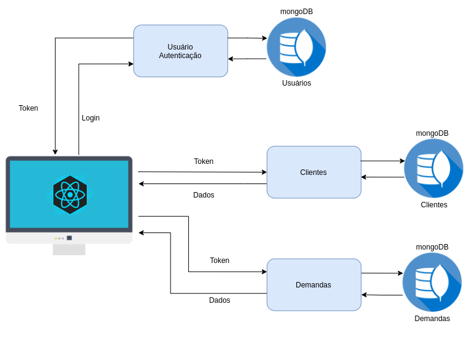
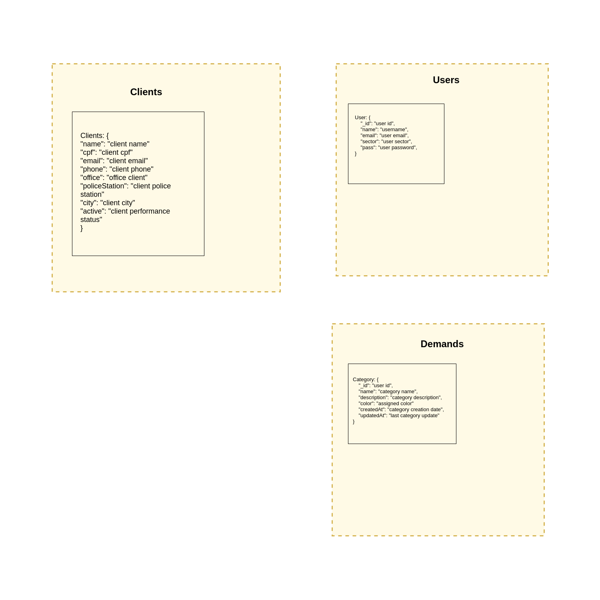
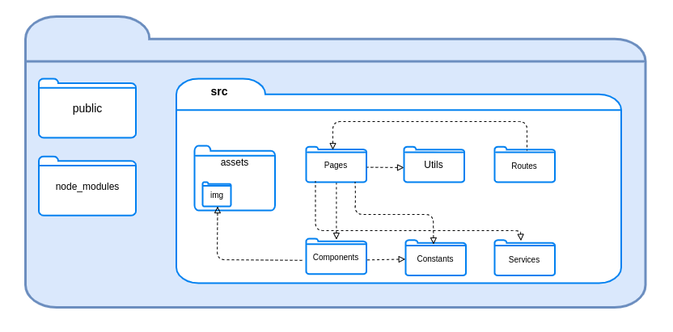
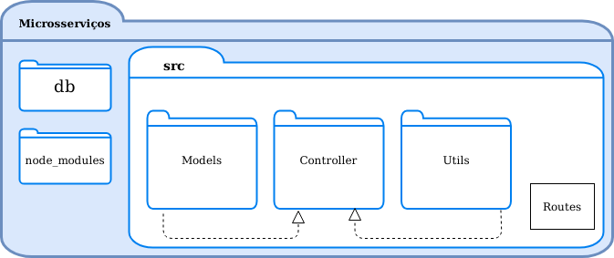

<h1 style='text-align: center;'>Documento de Arquitetura</h1>

### Sumário

[Introdução](#introducao)

[Representação da Arquitetura](#arquitetura)

[Metas e Restrições de Arquitetura](#metas)

[Visão de Implementação](#visao_implementacao)

<h2>1. Introdução</h2>

### Finalidade:

Esse documento de arquitetura tem como finalidade esclarecer e especificar decisões arquiteturais pertinentes durante o desenvolvimento do projeto, oferecendo uma visão geral das tecnologias e funcionalidades utilizadas.

### Escopo:

O *nomedoproduto* consiste em uma aplicação web que visa facilitar a gerência dos processos da Divisão de Proteção à Saúde do Servidor (DPSS). 

Nesse documento de arquitetura, é feita uma descrição dos termos arquiteturais utilizados no desenvolvimento desse produto de software.

<h2>2. Representação da Arquitetura</h2>

### Diagrama de relações

O diagrama representa a divisão da aplicação em microsserviços de usuário, clientes e demandas e suas correlações.

### Diagrama React/Microsserviços

#### **REACT**
A aplicação web utiliza no front-end o framework React. A divisão é feita em *Pages*, *Services*, *Components* e *Constants*

* Pages: armazena as telas do website.

* Services: local onde são realizadas as comunicações com a API.

* Components: reúne os componentes utilizados nas telas da aplicação, como botões e a navbar.

* Constants: armazena os códigos das cores utilizadas. 

#### **MICROSSERVIÇOS**
Dada a alta escalabilidade dos microsserviços, foram definidos três para essa aplicação, sendo eles o de usuários, responsável pela autenticação, o de demandas e o de clientes. O padrão JWT foi utilizado para fazer essa autenticação, portanto, um token é gerado no microsserviço de usuários e salvo na aplicação. Uma vez que haja um token válido, é possível fazer requisições em todos os microsserviços utilizando-o. 

Para o controle e armazenamento dos dados, foi empregado o banco de dados não relacional MongoDB. Cada microsserviço possui um banco de dados específico e a manipulção e visualização desses dados no website conta com o auxílio do NodeJS e do ExpressJS.

<h2>3. Metas e Restrições de Arquitetura</h2>
Metas:

- Estabilidade do sistema
- Clareza na apresentação das funcionalidades
- Facil manutenção

Restrições: 

- **React:** framework javascript utilizado para a criação da interface do usuário
- **Node.js:** desenvolvimento dos microsserviços
- **MongoDB**: banco de dados não relacional

<h2> 4. Visão de Implementação</h2>

### Modelagem de dados

### Diagrama de pacotes

#### **a) Frontend**

#### **b) Backend**

## 5. Bibliografia

[Policia Civil do Estado de Goiás](https://www.policiacivil.go.gov.br/cpss), Acesso em: 19/03/2021, 11:14, Horário de Brasília.

[MongoDB](https://docs.mongodb.com/cloud/), Acesso em: 19/03/2021, 11:14, Horário de Brasília.

[ReactJS](https://pt-br.reactjs.org/docs/getting-started.html), Acesso em: 19/03/2021, 11:14, Horário de Brasília.

[NodeJS](https://nodejs.org/en/docs/), Acesso em: 19/03/2021, 11:14, Horário de Brasília.

[Express](http://expressjs.com/pt-br/guide/routing.html), Acesso em: 19/03/2021, 11:15, Horário de Brasília.
