# Backlog do Produto

## Introdução

Durante a Lean Inception, foi feito um brainstorming com os PO's do projeto sobre as funcionalidades que devem ser implementadas, a partir disso foi feito o backlog do produto.

O backlog foi feito agrupando funcionalidades relacionadas, criado Épicos, cada Épico foi dividido em várias histórias de usuário.

Para a priorização das histórias de usuário, foi utulizada a técninca MoScoW.

## Backlog

### Épico: Tipos de usuário

Definir diferentes tipos de usuário que terão acesso ou algum tipo de contato com a aplicação em desenvolvimento. 

#### Funcionalidade do Lean Inception

#### Histórias de usuário
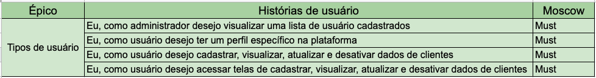

### Épico: Demandas

Criação e definição de categorias, setores e de demandas, e o relacionamento entre essas duas entidades importantes para o sistema.

***OBS.:** Para o controle das demandas de Covid-19, foi definido a utilização de categorias.*

#### Funcionalidades do Lean Inception

#### Histórias de usuário
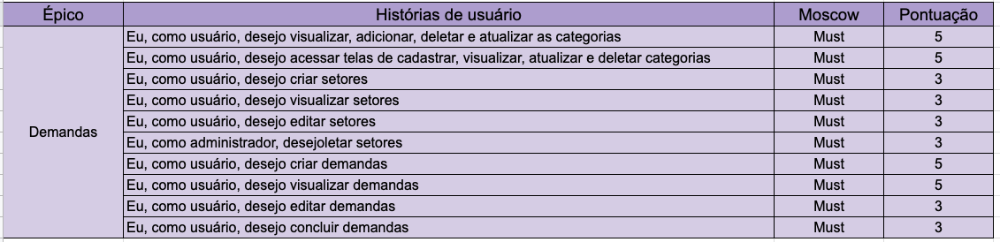

### Épico: Restrição de usuários

Restringir visualização de dados no sistema, de acordo com cargo, setor e do nivel de acesso do usuário que está tentando visualizar.

#### Funcionalidades do Lean Inception

#### Histórias de usuário
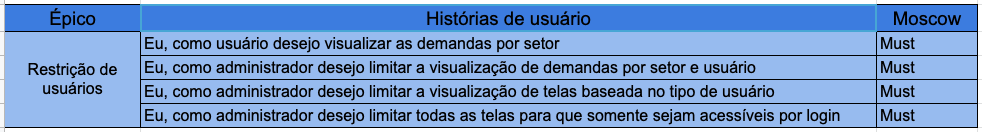

### Épico: Histórico de demandas

Registro de Evolução e alteração para cada demanda, tanto para atualizar o andamento da demanda quanto para uma alteração em uma demanda, podendo deletar e restringir acesso para cada atualização do histórico de demanda.

#### Funcionalidades do Lean Inception

#### Histórias de usuário
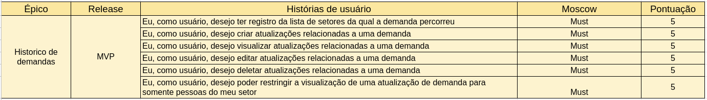

### Épico: Estatísticas Diárias

Realização das estatísticas de tipo de demanda e estatísticas gerais relacionadas aos setores.

#### Funcionalidades do Lean Inception

#### Histórias de usuário
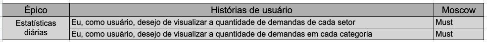

### Épico: Histórico de alteração

Listagem de quem fez uma alteração, seja em perfil de algum cliente, ou em  alguma demanda. além de mostrar qual a alteração que foi feita, e por quem foi feita.

#### Funcionalidades do Lean Inception

#### Histórias de usuário

### Épico: Prontuário

Listar todas as demandas relacionadas com um cliente específico, considerando a disponibilização de filtragem da lista de demandas.

#### Funcionalidades do Lean Inception
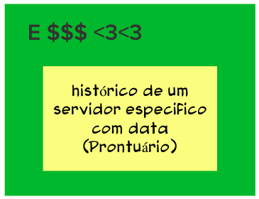

#### Histórias de usuário
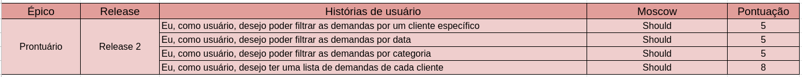

### Épico: Recuperar senha

Disponibilização da possibilidade de recuperação de senha para um usuário do sistema.

#### Funcionalidades do Lean Inception

#### Histórias de usuário
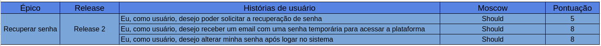

### Épico: Alertas de acompanhamento

Notificações ao usuário, relacionadas a chegada de demanda para este usuário, ou acompanhamento de uma demanda específica. disponibilizando filtros para melhor visualização de alertas.

#### Funcionalidades do Lean Inception

#### Histórias de usuário
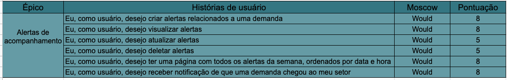

### Épico: Alertas de consultas

Notificação para o cliente, relacionada a dias de consulta, ou quando a data da consulta estiver próxima.

#### Funcionalidades do Lean Inception

#### Histórias de usuário

### Épico: Anexos de documentos

Possibilitar o anexo de arquivos para demandas com fins comprobatórios ou para evoluções da demanda.

#### Funcionalidades do Lean Inception
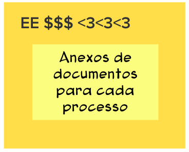

#### Histórias de usuário
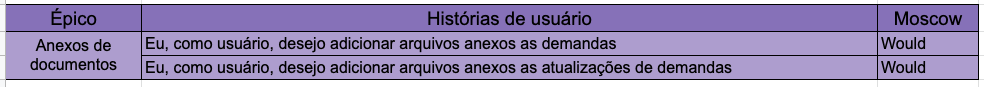