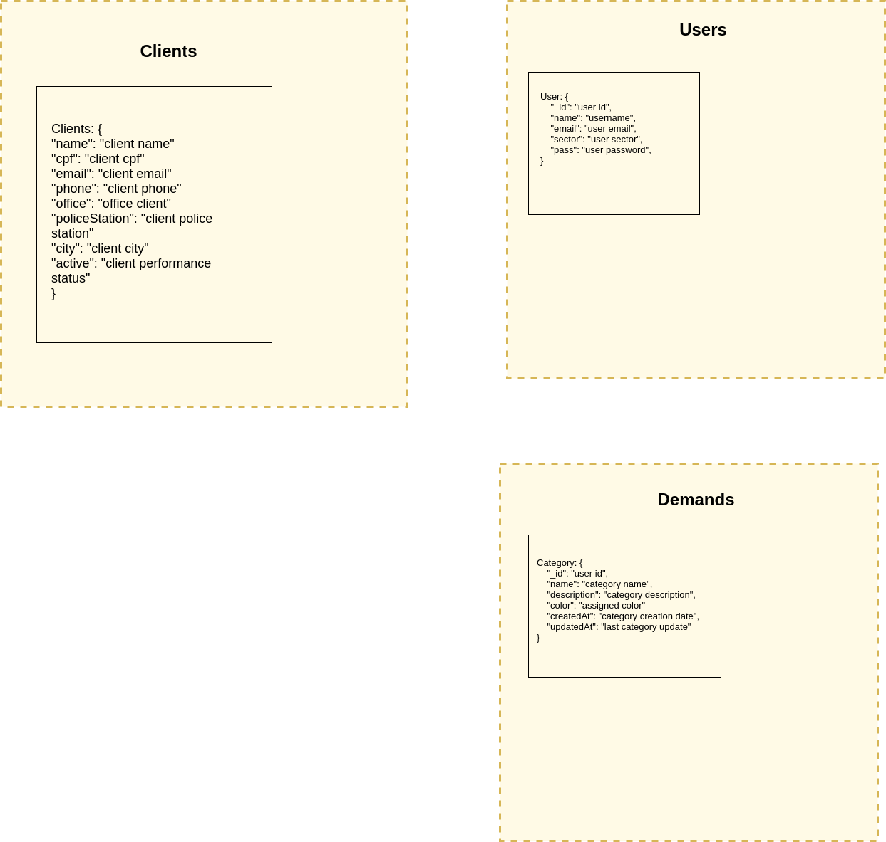
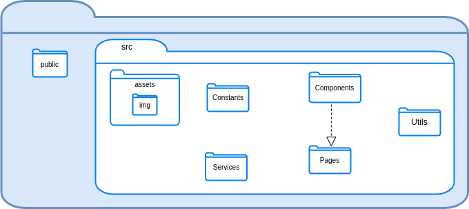
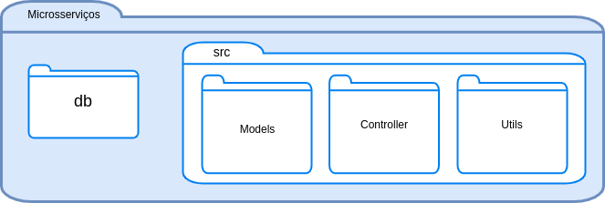

<h1 style='text-align: center;'>Documento de Arquitetura</h1>

### Sumario
[Introdução](#introducao)

[Representação da Arquitetura](#arquitetura)

[Metas e Restrições de Arquitetura](#metas)

[Visão de Implementação](#visao_implementacao)

<h2>1.Introdução</h2>
### Finalidade
Esse documento de arquitetura tem como finalidade esclarecer e especificar decisões arquiteturais pertinentes durante o desenvolvimento do projeto, oferecendo uma visão geral das tecnologias e funcionalidades utilizadas.
### Escopo
O *nomedoproduto* consiste em uma aplicação web que visa facilitar a gerência dos processos da Divisão de Proteção à Saúde do Servidor (DPSS). 

Nesse documento de arquitetura, é feita uma descrição dos termos arquiteturais utilizados no desenvolvimento desse produto de software.

### Referências

<h2>2. Representação da Arquitetura</h2>

### Diagrama de relações

O diagrama representa a divisão da aplicação em microsserviços de usuário, clientes e demandas e suas correlações.

### Diagrama React/Microsserviços

#### **REACT**
A aplicação web utiliza no front-end o framework React. A divisão é feita em *Pages*, *Services*, *Components* e *Constants*

> Pages: armazena as telas do website.

> Services: 

> Components: reúne os componentes utilizados nas telas da aplicação, como botões e a navbar.

> Constants: armazena os códigos das cores utilizadas. 
#### **MICROSSERVIÇOS**

<h2>3. Metas e Restrições de Arquitetura</h2>
> Metas
- Estabilidade do sistema
- Clareza na apresentação das funcionalidades
- Facil manutenção
> Restrições 
- **React:** framework javascript utilizado para a criação da interface do usuário
- **Node.js:** desenvolvimento dos microsserviços
- **MongoDB**: banco de dados não relacional

<h2> 4. Visão de Implementação</h2>
### Modelagem de dados

### Diagrama de pacotes

#### **A) Frontend**

#### **B) Backend**

## 5. Bibliografia
[Policia Civil do Estado de Goiásicia](https://www.policiacivil.go.gov.br/cpss)

[Documentação MongoDB](https://docs.mongodb.com/cloud/)

[Documentação ReactJS](https://pt-br.reactjs.org/docs/getting-started.html)

[Documentação NodeJS](https://nodejs.org/en/docs/)

[Documentação Express](http://expressjs.com/pt-br/guide/routing.html)
