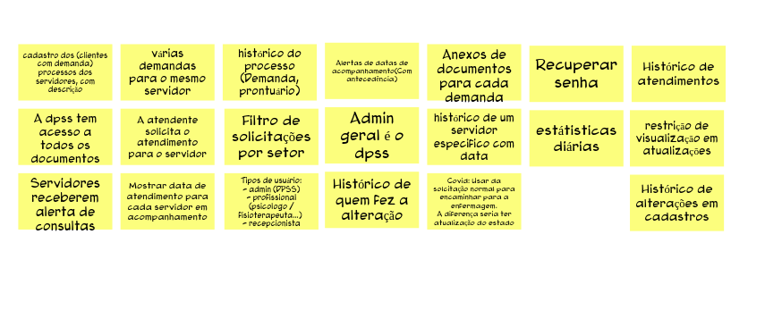

# Brainstoming De Funcionalidades

Dinâmica realizada com o intuito de elicitar funcionalidades necessárias para atender as jornadas de usuário que foram resultado de uma dinâmica anterior do Lean Inception, e definir as funcionalidades que de fato são significativas para o produto. 

Nessa etapa os participantes da tempestade de ideias apresentaram suas ideias de funcionalidade que agregaria ao produto, discutiu-se o que não agregaria entre as ideias, foram removidas as ideias duplicadas, até que os participantes chegaram em um conjunto de ideias de funcionalidades relevantes ao projeto.

