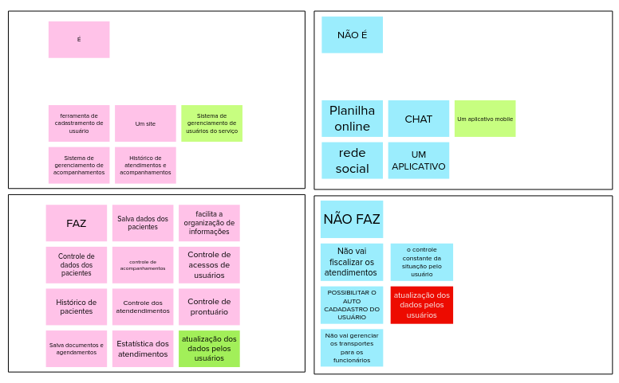

# O Produto É - NÃO É - FAZ - NÃO FAZ

Com o objetivo de melhorar a visão de produto e de algumas funcionalidades, como um time, realizamos a etapda de identificação de alguns objetivos do produto.

Durante a dinâmica, o time se separou em dois sub-grupos e ficaram responsáveis por responder o que o produto é e não é, enquanto a outra equipe ficou responsável por responde o que o produto faz e não faz. 

após ter definido os resultados preliminares, foi pedido para um menbro de um sub-grupo ler em voz alta um tópico do outro sub-grupo, e todo o grupo discutia sobre os resultados, e foi alcançado um resultado final para essa versão da dinâmica.

