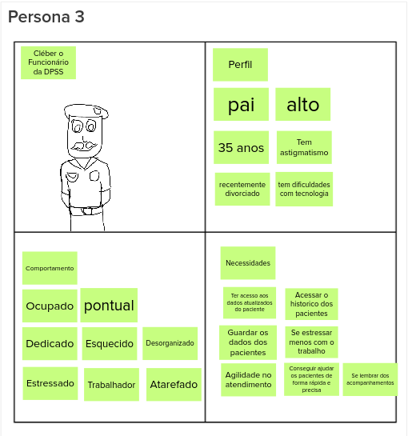

# Personas

Uma persona é uma representação ficticia  de usuários, interessados e possiveis clientes do produto proposto pela equipe. uma persona é baseada em dados reais, comportamentos, objetivos, desafios e preocupações. 

Para realizar a dinâmica o grupo foi dividido em três sub-grupos e cada grupo ficou responsável por idealizar uma persona, ao fim da idealização de cada persona, os sub-grupos foram reformulados, com o intuito de que outro sub-grupo melhorasse a definição de perfil, comportamento e necessidades daquela persona especifica, ao fim todos os menbros juntos discutiram sobre as caracteristicas da persona.

