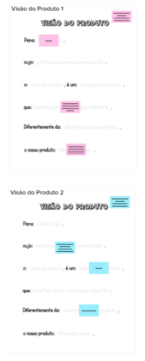
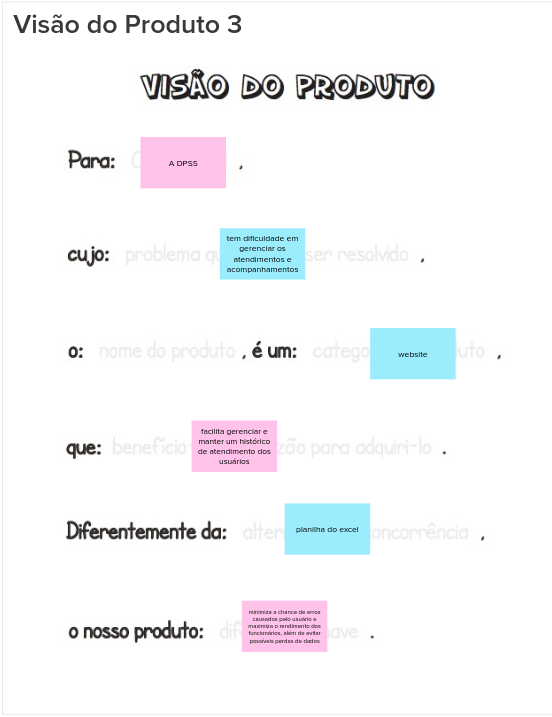

# Visão do Produto

Nessa dinâmica do Lean inception, a equipe foi dividida em dois grupos menores, onde o intuito era cada sub-grupo completar um pedaço da frase que define a visão do grupo sobre o produto, o intuito dessa dinâmica é igualar a frase que define a visão de produto de todo o time.

Após os dois sub-grupos apresentarem seus resultados parciais, foi pedido para um menbro de cada sub-grupo ler para o restante do time, coomo forma de ambos os sub-grupos entenderem a proposta da outra equipe.

### Resultado

Após essa dinâmica inicial, o grupo discutiu sobre os resultados parciais mostrados e chegou a uma conclusão sobre o resultado final da dinâmica

