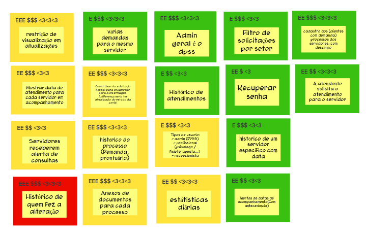

# Revisão Técnica, de Negócio e de UX

A etápa de brainstorming gera muitas funcionalidades, por isso precisamos analisar cada funcionalidade em termos de esforço **E**, valor de negócio **$** e confiança **<3**.

para avaliarmos esses três fatores, utilizamos uma escala de um a três

|Esforço|Negócio|Confiança|
| - | - | - |
|E|$|<3|
|EE|$$|<3<3|
|EEE|$$$|<3<3<3|

Para classificar o nivel de confiança é um pouco mais complexo, para cada caso analisaremos o nivel de confiança técnica da equipe, utilizando o gráfico semafóro, onde o nivel de confiança é mostrado por cor, as mesmas cores de um semafóro, verde: pode ir tranquilo; amarelo: Preste atenção, talvez tenha que aprar antes de prosseguir; vermelho: pare e espere ante de prosseguir.

Nessa dinâmica a pessoa facilitadora escolhe uma pessoa, essa pessoa faz a leitura da funcionalidade para o restante do grupo e classifica a funcionalidade de acordo com o seu ponto de vista, em seguida o restante do time discute sobre a classificação dada, chegando a um concensso, repetimos o processo para outra funcionalidade com outro menbro, até revisarmos todas as funcionalidades.

