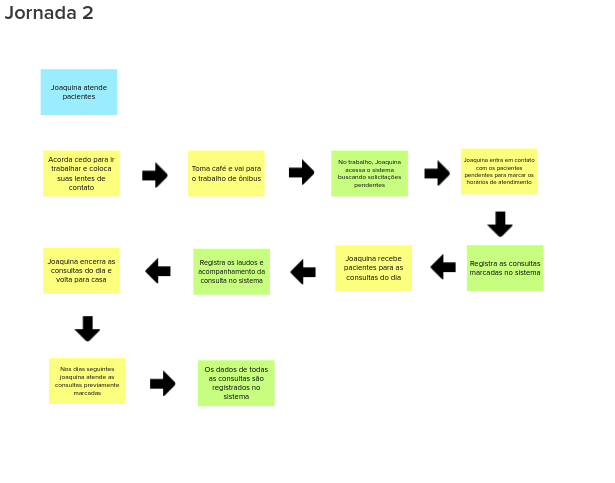
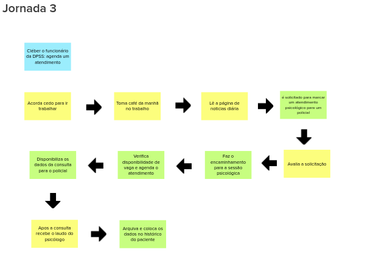

# Jornada de usuário

A jornada de usuário é feita se baseando na ultima dinâmica, que foi a dinâmica das personas, para cada persona, temos uma jornada diferente, uma jornada de usuário pode ser definida como uma sequência de passos de uma persona específica, onde em algum momento dessa jornada, nosso produto será util para aquela persona.

a dinâmica para a realização da dessa etapa grupo foi dividido em três sub-grupos e cada grupo ficou responsável por idealizar uma jornada, ao fim da idealização de cada jornada, os sub-grupos foram reformulados, com o intuito de que outro sub-grupo melhorasse a sequência de passos daquela jornada, ao fim todos os menbros juntos discutiram sobre os passos da jornada.

