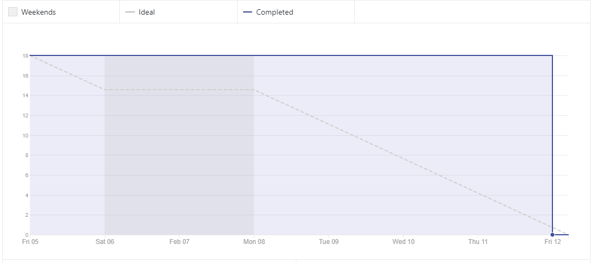
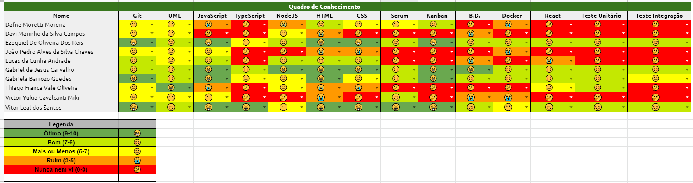

# Sprint 0 - Review 

## Resultados obtidos na sprint 0
Após debater sobre os temas, o grupo chegou a ideia de 3 temas. Além disso, o grupo de MDS começou a receber os treinamentos de algumas das tecnologias que serão utilizadas no projeto.

### Tarefas Realizadas

|Tarefa|Pontuação|Concluída|
|--|--|--|
|[Criar Documentação de Review da Sprint 0](https://github.com/fga-eps-mds/2020-2-g4/issues/12)|3|<image src="https://i.pinimg.com/originals/21/3d/c0/213dc0ed0a2e69d1978c75bfbcff903a.png" width=30 height=35>|
|[Criar Documentação de Planning da Sprint 0](https://github.com/fga-eps-mds/2020-2-g4/issues/14)|3|<image src="https://i.pinimg.com/originals/21/3d/c0/213dc0ed0a2e69d1978c75bfbcff903a.png" width=30 height=35>|
|[Criar quadro de conhecimento](https://github.com/fga-eps-mds/2020-2-g4/issues/1)|3|<image src="https://i.pinimg.com/originals/21/3d/c0/213dc0ed0a2e69d1978c75bfbcff903a.png" width=30 height=35>|
|[Pesquisa sobre possíveis temas](https://github.com/fga-eps-mds/2020-2-g4/issues/2)|3|<image src="https://i.pinimg.com/originals/21/3d/c0/213dc0ed0a2e69d1978c75bfbcff903a.png" width=30 height=35>|
|[Dojo de Git](https://github.com/fga-eps-mds/2020-2-g4/issues/4)|2|<image src="https://i.pinimg.com/originals/21/3d/c0/213dc0ed0a2e69d1978c75bfbcff903a.png" width=30 height=35>|
|[Dojo de JavaScript](https://github.com/fga-eps-mds/2020-2-g4/issues/5)|2|<image src="https://i.pinimg.com/originals/21/3d/c0/213dc0ed0a2e69d1978c75bfbcff903a.png" width=30 height=35>|
|[Dojo de HTML e CSS](https://github.com/fga-eps-mds/2020-2-g4/issues/6)|2|<image src="https://i.pinimg.com/originals/21/3d/c0/213dc0ed0a2e69d1978c75bfbcff903a.png" width=30 height=35>|

 

### Burndown
 

 *O gráfico de burndown acabou ficando desta maneira porque as issues foram criadas depois da sprint 0

### Velocity
 

### Conhecimento dos membros
  
 