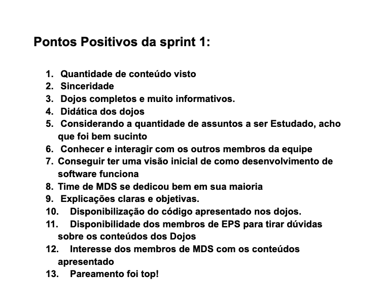
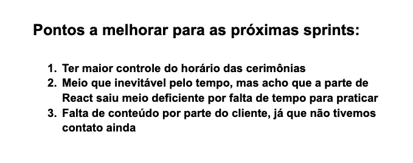

# Retrospectiva da Sprint 1

## Análise da sprint

- Durante a sprint 1 foram realizados alguns treinamentos para o time de MDS, onde ao final pôde-se perceber que foi bastante positivo e contribuiu para o aumento de conhecimento da equipe. Além disso, foi incentivado a realização de práticas de pareamento nas atividades práticas dos treinamentos para obter uma maior familiaridade com a prática ágil. 

- Já na parte de pontos a melhorar, podemos perceber que houveram dailys e cerimônias que fugiram do timebox pensado, necessitando de um maior controle futuro. Outro ponto de atenção é a falta de definição de escopo e pouco contato com cliente.

## Pontos Positivos listados pela equipe
  

## Pontos a melhorar listados pela equipe
  
