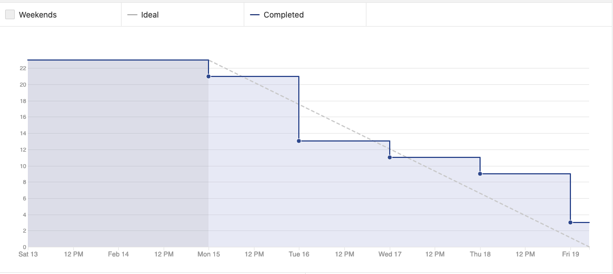
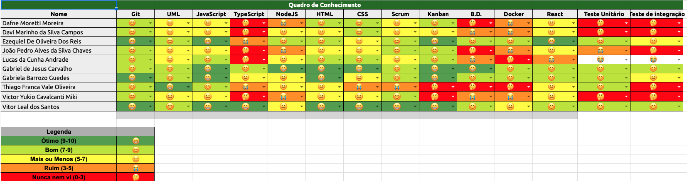

# Sprint 1 - Review 

## Resultados obtidos na sprint 1

A sprint foi bastante produtiva, todas as atividades foram concluídas, os pontos completados ficaram acima do velocity e o nível de conhecimento do time de MDS 
melhorou.

## Tarefas da sprint
 

### Tarefas Realizadas:

|Tarefa|Pontuação|Concluída|
|--|--|--|
|[Definição de licença do projeto]("https://github.com/fga-eps-mds/2020-2-G4/issues/3")|1|<image src="https://i.pinimg.com/originals/21/3d/c0/213dc0ed0a2e69d1978c75bfbcff903a.png" width=30 height=35>|
|[Elaborar Guia de contribuição]("https://github.com/fga-eps-mds/2020-2-G4/issues/7")|2|<image src="https://i.pinimg.com/originals/21/3d/c0/213dc0ed0a2e69d1978c75bfbcff903a.png" width=30 height=35>|
|[Dojo de React]("https://github.com/fga-eps-mds/2020-2-G4/issues/8")|2|<image src="https://i.pinimg.com/originals/21/3d/c0/213dc0ed0a2e69d1978c75bfbcff903a.png" width=30 height=35>|
|[Dojo Back-end]("https://github.com/fga-eps-mds/2020-2-G4/issues/11")|2|<image src="https://i.pinimg.com/originals/21/3d/c0/213dc0ed0a2e69d1978c75bfbcff903a.png" width=30 height=35>|
|[Adicionar Zenhub ao projeto]("https://github.com/fga-eps-mds/2020-2-G4/issues/9")|2|<image src="https://i.pinimg.com/originals/21/3d/c0/213dc0ed0a2e69d1978c75bfbcff903a.png" width=30 height=35>|
|[Estilizar o Github Pages]("https://github.com/fga-eps-mds/2020-2-G4/issues/22")|2|<image src="https://i.pinimg.com/originals/21/3d/c0/213dc0ed0a2e69d1978c75bfbcff903a.png" width=30 height=35>|
|[Criar Documentação de Planning da Sprint 1]("https://github.com/fga-eps-mds/2020-2-G4/issues/19")|2|<image src="https://i.pinimg.com/originals/21/3d/c0/213dc0ed0a2e69d1978c75bfbcff903a.png" width=30 height=35>|
|[Criar Documentação de Review da Sprint 1]("https://github.com/fga-eps-mds/2020-2-G4/issues/15")|2|<image src="https://i.pinimg.com/originals/21/3d/c0/213dc0ed0a2e69d1978c75bfbcff903a.png" width=30 height=35>|
|[Adicionar MKDocs ao repositório]("https://github.com/fga-eps-mds/2020-2-G4/issues/10")|3|<image src="https://i.pinimg.com/originals/21/3d/c0/213dc0ed0a2e69d1978c75bfbcff903a.png" width=30 height=35>|
|[Estudo para aplicação do lean inception]("https://github.com/fga-eps-mds/2020-2-G4/issues/13")|3|<image src="https://i.pinimg.com/originals/21/3d/c0/213dc0ed0a2e69d1978c75bfbcff903a.png" width=30 height=35>|

 

### Burndown
 

### Velocity
 

### Conhecimento dos membros
  
 