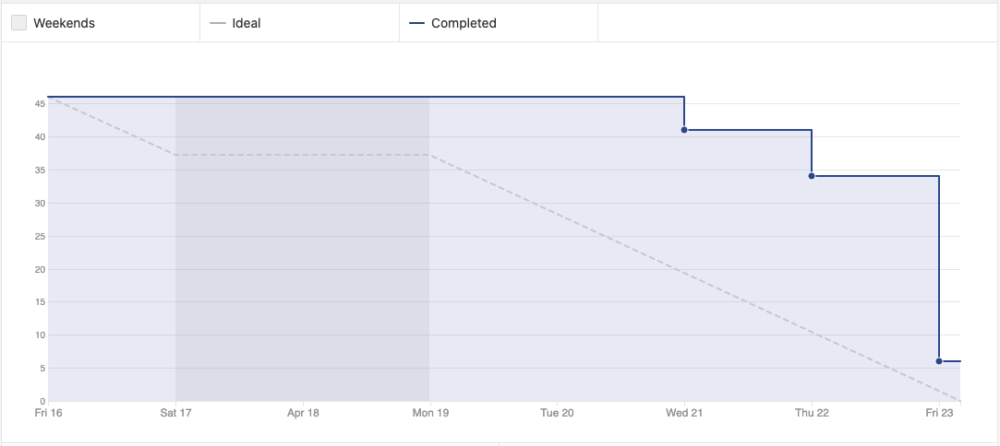
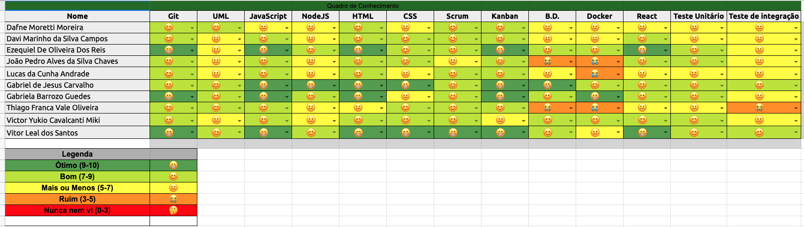

# Sprint 10 - Review 

## Resultados obtidos na sprint 10

Na sprint 10 a quantidade de pontos concluídos aumentou, devido ao pareamento entre EPS e MDS, com isso a produtividade do time melhorou.

## Tarefas da sprint

### Tarefas Realizadas:

|Tarefa|Pontuação|Concluída|
|--|--|--|
[Criar Documentação de Review da Sprint 8](https://github.com/fga-eps-mds/2020-2-SiGeD/issues/198)|2|<image src="https://i.pinimg.com/originals/21/3d/c0/213dc0ed0a2e69d1978c75bfbcff903a.png" width=30 height=35>|
[Criar Documentação de Planning da Sprint 10](https://github.com/fga-eps-mds/2020-2-SiGeD/issues/195)|2|<image src="https://i.pinimg.com/originals/21/3d/c0/213dc0ed0a2e69d1978c75bfbcff903a.png" width=30 height=35>|
[Roadmap](https://github.com/fga-eps-mds/2020-2-SiGeD/issues/194)|3|<image src="https://i.pinimg.com/originals/21/3d/c0/213dc0ed0a2e69d1978c75bfbcff903a.png" width=30 height=35>|
[Atualizar template de Pull Requests](https://github.com/fga-eps-mds/2020-2-SiGeD/issues/189)|1|<image src="https://i.pinimg.com/originals/21/3d/c0/213dc0ed0a2e69d1978c75bfbcff903a.png" width=30 height=35>|
[Doc Pipeline](https://github.com/fga-eps-mds/2020-2-SiGeD/issues/200)|2|<image src="https://i.pinimg.com/originals/21/3d/c0/213dc0ed0a2e69d1978c75bfbcff903a.png" width=30 height=35>|
[Consertar documento de arquitetura](https://github.com/fga-eps-mds/2020-2-SiGeD/issues/197)|1|<image src="https://i.pinimg.com/originals/21/3d/c0/213dc0ed0a2e69d1978c75bfbcff903a.png" width=30 height=35>|
[Gráfico de demandas por setor](https://github.com/fga-eps-mds/2020-2-SiGeD/issues/197)|3|<image src="https://i.pinimg.com/originals/21/3d/c0/213dc0ed0a2e69d1978c75bfbcff903a.png" width=30 height=35>|
[Gráfico/estatísticas de demandas por categorias](https://github.com/fga-eps-mds/2020-2-SiGeD/issues/201)|3|<image src="https://i.pinimg.com/originals/21/3d/c0/213dc0ed0a2e69d1978c75bfbcff903a.png" width=30 height=35>|
[Fix - Modal de editar](https://github.com/fga-eps-mds/2020-2-SiGeD/issues/205)|1|<image src="https://i.pinimg.com/originals/21/3d/c0/213dc0ed0a2e69d1978c75bfbcff903a.png" width=30 height=35>|
[FIX - Atualizar lista de usuários](https://github.com/fga-eps-mds/2020-2-SiGeD/issues/207)|1|<image src="https://i.pinimg.com/originals/21/3d/c0/213dc0ed0a2e69d1978c75bfbcff903a.png" width=30 height=35>|
[Corrigir multiplos alertas retornando respostas opostas](https://github.com/fga-eps-mds/2020-2-SiGeD/issues/208)|1|<image src="https://i.pinimg.com/originals/21/3d/c0/213dc0ed0a2e69d1978c75bfbcff903a.png" width=30 height=35>|
[Fix - Modal de erro e sucesso](https://github.com/fga-eps-mds/2020-2-SiGeD/issues/211)|2|<image src="https://i.pinimg.com/originals/21/3d/c0/213dc0ed0a2e69d1978c75bfbcff903a.png" width=30 height=35>|
[Solicitar confirmação ao deletar algo e padronizar alertas](https://github.com/fga-eps-mds/2020-2-SiGeD/issues/212)|2|<image src="https://i.pinimg.com/originals/21/3d/c0/213dc0ed0a2e69d1978c75bfbcff903a.png" width=30 height=35>|
[Enviar senha temporária](https://github.com/fga-eps-mds/2020-2-SiGeD/issues/199)|3|<image src="https://i.pinimg.com/originals/21/3d/c0/213dc0ed0a2e69d1978c75bfbcff903a.png" width=30 height=35>|
[Recuperação de senha](https://github.com/fga-eps-mds/2020-2-SiGeD/issues/204)|3|<image src="https://i.pinimg.com/originals/21/3d/c0/213dc0ed0a2e69d1978c75bfbcff903a.png" width=30 height=35>|
[Alteração de senha](https://github.com/fga-eps-mds/2020-2-SiGeD/issues/209)|5|<image src="https://i.pinimg.com/originals/21/3d/c0/213dc0ed0a2e69d1978c75bfbcff903a.png" width=30 height=35>|
[Criação de um filtro, por ano, referente as demandas já criadas](https://github.com/fga-eps-mds/2020-2-SiGeD/issues/202)|2|<image src="https://i.pinimg.com/originals/21/3d/c0/213dc0ed0a2e69d1978c75bfbcff903a.png" width=30 height=35>|
[Network Docker](https://github.com/fga-eps-mds/2020-2-SiGeD/issues/203)|2|<image src="https://i.pinimg.com/originals/21/3d/c0/213dc0ed0a2e69d1978c75bfbcff903a.png" width=30 height=35>|
[Criação de um filtro de categorias na tela de demandas](https://github.com/fga-eps-mds/2020-2-SiGeD/issues/210)|2|<image src="https://i.pinimg.com/originals/21/3d/c0/213dc0ed0a2e69d1978c75bfbcff903a.png" width=30 height=35>|
[Filtro dos gráficos](https://github.com/fga-eps-mds/2020-2-SiGeD/issues/206)|5|<image src="https://contmoura.com.br/wp-content/uploads/2019/09/x-png-icon-8.png" width=30 height=30>|

### Burndown
 

### Velocity
 

### Conhecimento dos membros
 
 