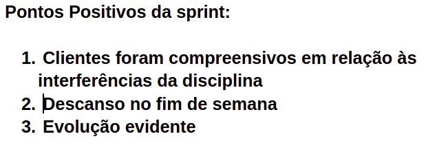
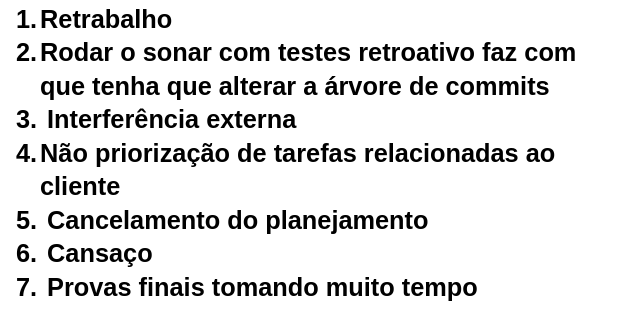

# Retrospectiva da Sprint 12

## Análise da sprint

- Foi uma semana atípica, o time escolheu dar um pausa no trabalho para resolver problemas pessoais.
- O time conversou com os donos do produto para um possível replanejamento das atividades, foi uma conversa tranquila e muito proveitosa.

## Pontos Positivos listados pela equipe
  

## Pontos a Melhorar listados pela equipe 
  