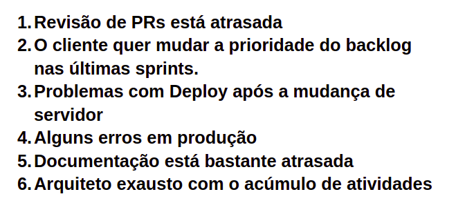

# Retrospectiva da Sprint 13

## Análise da sprint

- Esforços dos time voltados ao problema de coleta de dados.
- diminuição no ritmo da entrega de novas release e foco em consertar erros em produção.

## Pontos Positivos listados pela equipe
  

## Pontos a Melhorar listados pela equipe 
  