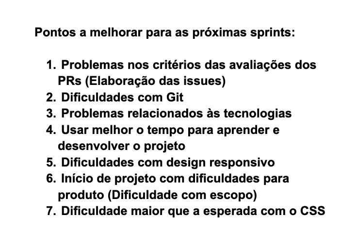

# Retrospectiva da Sprint 2

## Análise da sprint

- Durante a sprint 2 foram observados alguns aspectos muito positivos durante a sprint, houve o início da prática com as tecnologias que serão envolvidas no projeto, além disso a equipe MDS e EPS teve um ótimo entrosamento durante a semana, e também houve o início da reunião com o cliente, onde o time todo participou. Além disso, a prática de pareamento funcionou bem ao longo da semana.

- Já em pontos a melhorar, observa-se que ao longo da sprint houveram algumas dificuldades relacionadas as tecnologias por parte da equipe de MDS, além disso o escopo do projeto não estava claro o suficiente. Por fim, algumas Issues tiveram problemas de elaboração, necessitando de uma revisão após a criação.

## Pontos Positivos listados pela equipe
  

## Pontos a melhorar listados pela equipe
  
