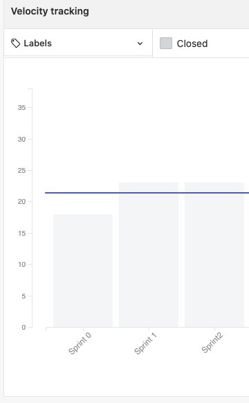

# Sprint 2 - Review 

## Resultados obtidos na sprint 2

A sprint 2 teve uma estabilização nos pontos completados pela equipe, em razão da dificuldade no início das atividades de desenvolvimento realizadas pelo time de MDS, mesmo assim, apenas uma issue teve débito técnico, além disso, a sprint contou com ótimas práticas de pareamento e dedicação do time de MDS.

## Tarefas da sprint

### Tarefas Realizadas:

|Tarefa|Pontuação|Concluída|
|--|--|--|
|[Iniciar o projeto do backend](https://github.com/fga-eps-mds/2020-2-G4/issues/3)|1|<image src="https://i.pinimg.com/originals/21/3d/c0/213dc0ed0a2e69d1978c75bfbcff903a.png" width=30 height=35>|
|[Iniciar projeto do frontend](https://github.com/fga-eps-mds/2020-2-G4/issues/7)|1|<image src="https://i.pinimg.com/originals/21/3d/c0/213dc0ed0a2e69d1978c75bfbcff903a.png" width=30 height=35>|
|[Dojo de docker](https://github.com/fga-eps-mds/2020-2-G4/issues/8)|2|<image src="https://i.pinimg.com/originals/21/3d/c0/213dc0ed0a2e69d1978c75bfbcff903a.png" width=30 height=35>|
|[Dockerizar o frontend](https://github.com/fga-eps-mds/2020-2-G4/issues/11)|2|<image src="https://i.pinimg.com/originals/21/3d/c0/213dc0ed0a2e69d1978c75bfbcff903a.png" width=30 height=35>|
|[Dockerizar o backend](https://github.com/fga-eps-mds/2020-2-G4/issues/9)|3|<image src="https://i.pinimg.com/originals/21/3d/c0/213dc0ed0a2e69d1978c75bfbcff903a.png" width=30 height=35>|
|[Criar Documentação de Planning da Sprint 2](https://github.com/fga-eps-mds/2020-2-G4/issues/22)|3|<image src="https://i.pinimg.com/originals/21/3d/c0/213dc0ed0a2e69d1978c75bfbcff903a.png" width=30 height=35>|
|[Criar Documentação de Review da Sprint 2](https://github.com/fga-eps-mds/2020-2-G4/issues/19)|3|<image src="https://i.pinimg.com/originals/21/3d/c0/213dc0ed0a2e69d1978c75bfbcff903a.png" width=30 height=35>|
|[Tela de login do usuário](https://github.com/fga-eps-mds/2020-2-G4/issues/15)|3|<image src="https://i.pinimg.com/originals/21/3d/c0/213dc0ed0a2e69d1978c75bfbcff903a.png" width=30 height=35>|
|[Tela de cadastro de usuario](https://github.com/fga-eps-mds/2020-2-G4/issues/10)|5|<image src="https://i.pinimg.com/originals/21/3d/c0/213dc0ed0a2e69d1978c75bfbcff903a.png" width=30 height=35>|
|[CRUD de usuários no backend](https://github.com/fga-eps-mds/2020-2-G4/issues/13)|5|<image src="https://contmoura.com.br/wp-content/uploads/2019/09/x-png-icon-8.png" width=30 height=30>|

- A issue ***CRUD de usuários no backend*** não foi finalizada devido a falta de validação nos campos.

### Burndown
 

### Velocity
 

### Conhecimento dos membros
  
 