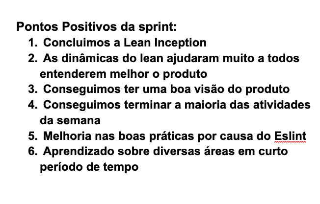
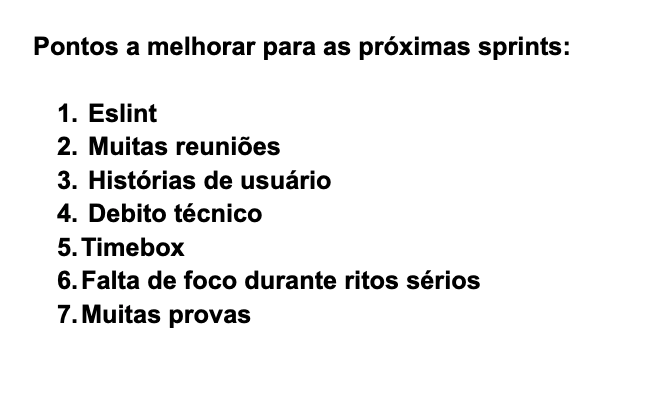

# Retrospectiva da Sprint 3

## Análise da sprint

- A sprint 3 teve o principal objetivo de fazer o lean inception e a definição do produto junto com os clientes do produto.
- Ao final da sprint foi possível ter uma boa visão do produto.
- Foi adicionado o eslint, reforçando boas práticas e padrões de código.

## Pontos Positivos listados pela equipe
  

## Pontos a Melhorar listados pela equipe
  
