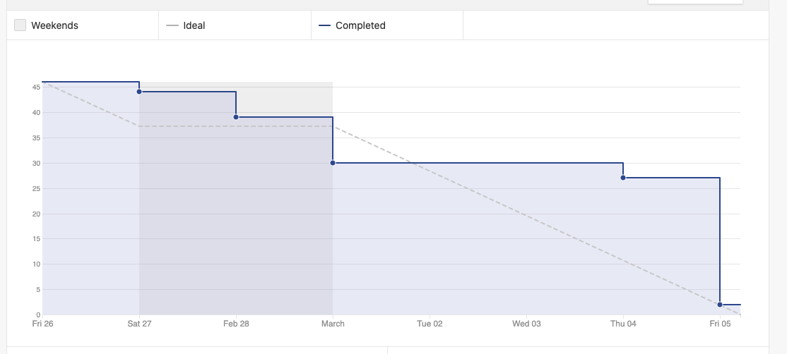

# Sprint 3 - Review 

## Resultados obtidos na sprint 3

A sprint 3 foi bastante produtiva, onde houve a conclusão do lean inception e aumento do velocity, havendo também a definição do MVP. Algumas issues não foram finalizadas, pelo motivo do grande tempo que a issue de Lean inception tomou ao longo da sprint.

## Tarefas da sprint

### Tarefas Realizadas:

|Tarefa|Pontuação|Concluída|
|--|--|--|
|[Criação de uma Navbar](https://github.com/fga-eps-mds/2020-2-SiGeD/issues/3)|1|<image src="https://i.pinimg.com/originals/21/3d/c0/213dc0ed0a2e69d1978c75bfbcff903a.png" width=30 height=35>|
|[Criar template de documentação das retrospectivas de sprint](https://github.com/fga-eps-mds/2020-2-SiGeD/issues/7)|1|<image src="https://i.pinimg.com/originals/21/3d/c0/213dc0ed0a2e69d1978c75bfbcff903a.png" width=30 height=35>|
|[Criar Documentação de Review da Sprint 3](https://github.com/fga-eps-mds/2020-2-SiGeD/issues/11)|2|<image src="https://i.pinimg.com/originals/21/3d/c0/213dc0ed0a2e69d1978c75bfbcff903a.png" width=30 height=35>|
|[Criar Documentação de Planning da Sprint 3](https://github.com/fga-eps-mds/2020-2-SiGeD/issues/9)|3|<image src="https://i.pinimg.com/originals/21/3d/c0/213dc0ed0a2e69d1978c75bfbcff903a.png" width=30 height=35>|
|[Conexão da tela de cadastro com API e Validações](https://github.com/fga-eps-mds/2020-2-SiGeD/issues/22)|3|<image src="https://i.pinimg.com/originals/21/3d/c0/213dc0ed0a2e69d1978c75bfbcff903a.png" width=30 height=35>|
|[Aplicação do lean inception](https://github.com/fga-eps-mds/2020-2-SiGeD/issues/19)|3|<image src="https://i.pinimg.com/originals/21/3d/c0/213dc0ed0a2e69d1978c75bfbcff903a.png" width=30 height=35>|
|[Folha de estilo + CI](https://github.com/fga-eps-mds/2020-2-SiGeD/issues/15)|3|<image src="https://i.pinimg.com/originals/21/3d/c0/213dc0ed0a2e69d1978c75bfbcff903a.png" width=30 height=35>|
|[Criar as rotas no frontend](https://github.com/fga-eps-mds/2020-2-SiGeD/issues/10)|5|<image src="https://i.pinimg.com/originals/21/3d/c0/213dc0ed0a2e69d1978c75bfbcff903a.png" width=30 height=35>|
|[Criar o protótipo da tela de listar usuários](https://github.com/fga-eps-mds/2020-2-SiGeD/issues/15)|3|<image src="https://i.pinimg.com/originals/21/3d/c0/213dc0ed0a2e69d1978c75bfbcff903a.png" width=30 height=35>|
|[CRUD de usuários no backend](https://github.com/fga-eps-mds/2020-2-SiGeD/issues/15)|3|<image src="https://i.pinimg.com/originals/21/3d/c0/213dc0ed0a2e69d1978c75bfbcff903a.png" width=30 height=35>|
|[Lista de usuário](https://github.com/fga-eps-mds/2020-2-SiGeD/issues/13)|5|<image src="https://contmoura.com.br/wp-content/uploads/2019/09/x-png-icon-8.png" width=30 height=30>|
|[Adicionar documentação de gerenciamento de riscos na wiki](https://github.com/fga-eps-mds/2020-2-SiGeD/issues/8)|2|<image src="https://contmoura.com.br/wp-content/uploads/2019/09/x-png-icon-8.png" width=30 height=30>|

- As issues ***Lista de usuário*** e ***Adicionar documentação de gerenciamento de riscos na wiki*** foram como débito técnico para a próxima sprint

### Burndown
 

### Velocity
 

### Conhecimento dos membros
  
 