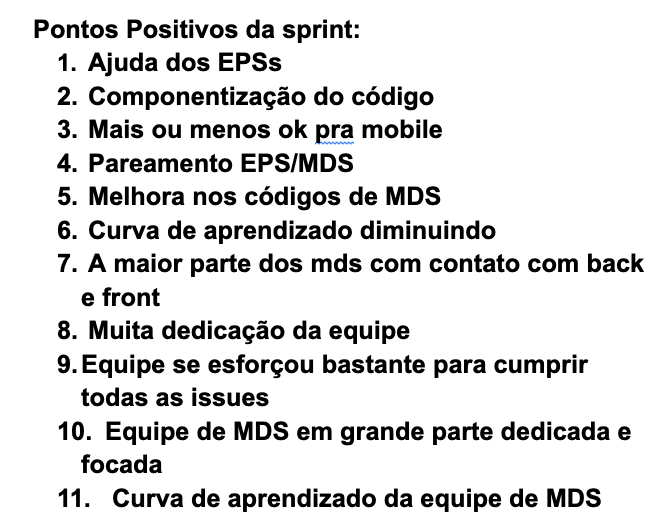

# Retrospectiva da Sprint 4

## Análise da sprint

- Na sprint 4 começamos o desenvolvimento com base nos épicos definidos pela lean inception
- Durante a sprint teve um grande esforço para melhorar o código em relação a componentização.
- A sprint teve vários pareamentos entre MDS e EPS onde a equipe conseguiu ter um alto rendimento.

## Pontos Positivos listados pela equipe
  

## Pontos a Melhorar listados pela equipe
  