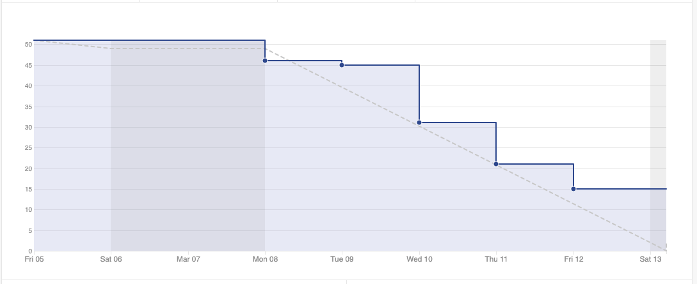
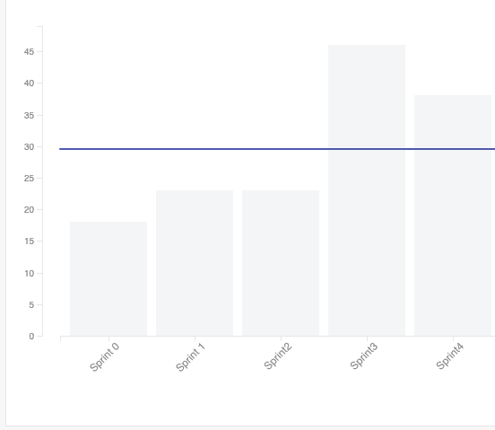
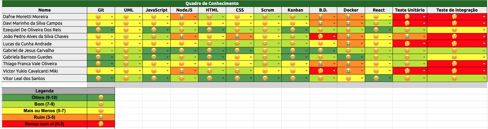

# Sprint 4 - Review 

## Resultados obtidos na sprint 4

Na sprint 4 a quantidade de pontos concluídos diminuiu, devido ao erro de pontuação na hora da pontuação das histórias, isso causou a impressão que as issues pontuadas eram menores do que de fato eram, havendo então novos débitos técnicos. 

Nos outros quesitos, a sprint foi bem produtiva e o ritmo do trabalho do time foi bem distribuído, havendo apenas as issues que tiveram uma estimativa errada como débito técnico.

## Tarefas da sprint

### Tarefas Realizadas:

|Tarefa|Pontuação|Concluída|
|--|--|--|
[Protótipo telas sprint4 ](https://github.com/fga-eps-mds/2020-2-G4/issues/68)|1|<image src="https://i.pinimg.com/originals/21/3d/c0/213dc0ed0a2e69d1978c75bfbcff903a.png" width=30 height=35>|
|[FIX Eslint](https://github.com/fga-eps-mds/2020-2-G4/issues/71)|1|<image src="https://i.pinimg.com/originals/21/3d/c0/213dc0ed0a2e69d1978c75bfbcff903a.png" width=30 height=35>|
[Melhorar o guia de contribuição](https://github.com/fga-eps-mds/2020-2-G4/issues/68)|2|<image src="https://i.pinimg.com/originals/21/3d/c0/213dc0ed0a2e69d1978c75bfbcff903a.png" width=30 height=35>|
[Nivel de permissao de usuários](https://github.com/fga-eps-mds/2020-2-G4/issues/58)|2|<image src="https://i.pinimg.com/originals/21/3d/c0/213dc0ed0a2e69d1978c75bfbcff903a.png" width=30 height=35>|
[Criar Documentação de Review da Sprint 4](https://github.com/fga-eps-mds/2020-2-G4/issues/67)|2|<image src="https://i.pinimg.com/originals/21/3d/c0/213dc0ed0a2e69d1978c75bfbcff903a.png" width=30 height=35>|
[Criar Documentação de Planning da Sprint 4](https://github.com/fga-eps-mds/2020-2-G4/issues/66)|3|<image src="https://i.pinimg.com/originals/21/3d/c0/213dc0ed0a2e69d1978c75bfbcff903a.png" width=30 height=35>|
[Correção de usuário no backend](https://github.com/fga-eps-mds/2020-2-G4/issues/60)|3|<image src="https://i.pinimg.com/originals/21/3d/c0/213dc0ed0a2e69d1978c75bfbcff903a.png" width=30 height=35>|
[Definição da arquitetura](https://github.com/fga-eps-mds/2020-2-G4/issues/16)|3|<image src="https://i.pinimg.com/originals/21/3d/c0/213dc0ed0a2e69d1978c75bfbcff903a.png" width=30 height=35>|
[Criar Documentação do lean inception](https://github.com/fga-eps-mds/2020-2-G4/issues/70)|3|<image src="https://i.pinimg.com/originals/21/3d/c0/213dc0ed0a2e69d1978c75bfbcff903a.png" width=30 height=35>|
[Pesquisar sobre o SonarQube](https://github.com/fga-eps-mds/2020-2-G4/issues/69)|3|<image src="https://i.pinimg.com/originals/21/3d/c0/213dc0ed0a2e69d1978c75bfbcff903a.png" width=30 height=35>|
[CRUD de categorias no backend](https://github.com/fga-eps-mds/2020-2-G4/issues/63)|5|<image src="https://i.pinimg.com/originals/21/3d/c0/213dc0ed0a2e69d1978c75bfbcff903a.png" width=30 height=35>|
[CRUD de clientes no backend](https://github.com/fga-eps-mds/2020-2-G4/issues/62)|5|<image src="https://i.pinimg.com/originals/21/3d/c0/213dc0ed0a2e69d1978c75bfbcff903a.png" width=30 height=35>|
[Adicionar documentação de gerenciamento de riscos na wiki](https://github.com/fga-eps-mds/2020-2-G4/issues/43)|5|<image src="https://i.pinimg.com/originals/21/3d/c0/213dc0ed0a2e69d1978c75bfbcff903a.png" width=30 height=35>|
[Correção de usuário no front-end](https://github.com/fga-eps-mds/2020-2-G4/issues/61)|3|<image src="https://contmoura.com.br/wp-content/uploads/2019/09/x-png-icon-8.png" width=30 height=30>|
[CRUD de clientes no frontend](https://github.com/fga-eps-mds/2020-2-G4/issues/62)|5|<image src="https://contmoura.com.br/wp-content/uploads/2019/09/x-png-icon-8.png" width=30 height=30>|
[CRUD de categorias no frontend](https://github.com/fga-eps-mds/2020-2-G4/issues/65)|5|<image src="https://contmoura.com.br/wp-content/uploads/2019/09/x-png-icon-8.png" width=30 height=30>|

- As issues ***CRUD de clientes no frontend*** e ***Correção de usuário no front-end*** e ***CRUD de categorias no frontend*** foram como débito técnico para a próxima sprint pelo erro de estimativa comentado acima, não permitindo a conclusão das mesmas.

### Burndown
 

### Velocity
 

### Conhecimento dos membros
 
 