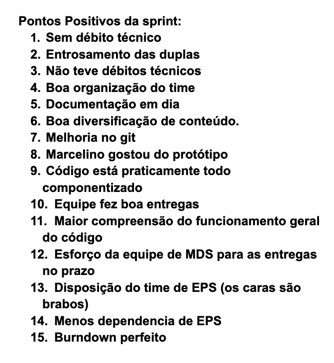
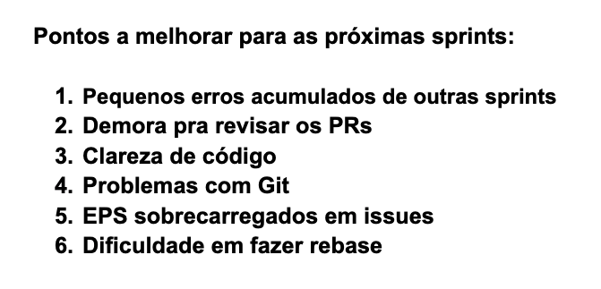

# Retrospectiva da Sprint 5

## Análise da sprint

- Sprint muito produtiva, não houve débitos tecnicos
- Sprint muito focada em relação a documentação
- Houve uma sobrecarga de issues nos membros de EPS, devido a tarefas atrasadas que ainda não haviam sido planejadas de documentação.

## Pontos Positivos listados pela equipe
  

## Pontos a Melhorar listados pela equipe 
  