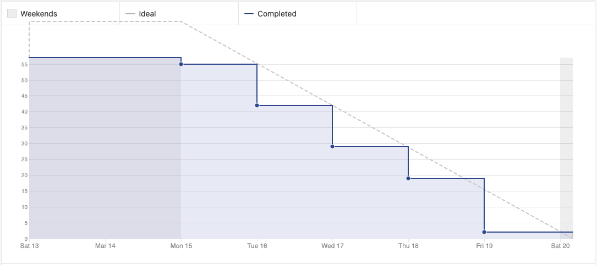
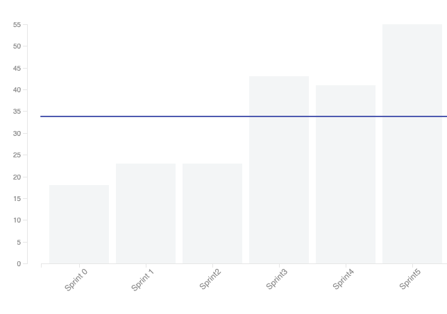
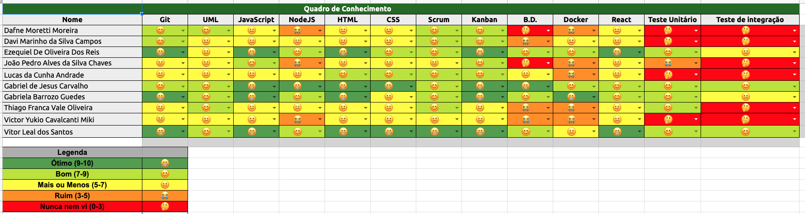

# Sprint 5 - Review 

## Resultados obtidos na sprint 5

Na sprint 5 a quantidade de pontos concluídos aumentou, as tarefas foram concluídas totalmente e no devido tempo, a equipe trabalhou super bem.

A sprint focou-se bastante em documentação, o que acabou gerando uma certa sobrecarga sobre os membros de EPS, porém todas as tarefas foram concluídas.

## Tarefas da sprint

### Tarefas Realizadas:

|Tarefa|Pontuação|Concluída|
|--|--|--|
[Criar Documentação de Review da Sprint 5](https://github.com/fga-eps-mds/2020-2-G4/issues/83)|2|<image src="https://i.pinimg.com/originals/21/3d/c0/213dc0ed0a2e69d1978c75bfbcff903a.png" width=30 height=35>|
[Criar Documentação de Planning da Sprint 5](https://github.com/fga-eps-mds/2020-2-G4/issues/82)|2|<image src="https://i.pinimg.com/originals/21/3d/c0/213dc0ed0a2e69d1978c75bfbcff903a.png" width=30 height=35>|
[Documentação da metodologia](https://github.com/fga-eps-mds/2020-2-G4/issues/79)|2|<image src="https://i.pinimg.com/originals/21/3d/c0/213dc0ed0a2e69d1978c75bfbcff903a.png" width=30 height=35>|
[Sonar Cloud](https://github.com/fga-eps-mds/2020-2-G4/issues/78)|2|<image src="https://i.pinimg.com/originals/21/3d/c0/213dc0ed0a2e69d1978c75bfbcff903a.png" width=30 height=35>|
[Componentização do Axios](https://github.com/fga-eps-mds/2020-2-G4/issues/80)|2|<image src="https://i.pinimg.com/originals/21/3d/c0/213dc0ed0a2e69d1978c75bfbcff903a.png" width=30 height=35>|
[Criar documento de Readme](https://github.com/fga-eps-mds/2020-2-G4/issues/87)|2|<image src="https://i.pinimg.com/originals/21/3d/c0/213dc0ed0a2e69d1978c75bfbcff903a.png" width=30 height=35>|
[Criar documento de Arquitetura](https://github.com/fga-eps-mds/2020-2-G4/issues/81)|3|<image src="https://i.pinimg.com/originals/21/3d/c0/213dc0ed0a2e69d1978c75bfbcff903a.png" width=30 height=35>|
[Criar documento de Visão](https://github.com/fga-eps-mds/2020-2-G4/issues/84)|3|<image src="https://i.pinimg.com/originals/21/3d/c0/213dc0ed0a2e69d1978c75bfbcff903a.png" width=30 height=35>|
[Identidade Visual](https://github.com/fga-eps-mds/2020-2-G4/issues/92)|3|<image src="https://i.pinimg.com/originals/21/3d/c0/213dc0ed0a2e69d1978c75bfbcff903a.png" width=30 height=35>|
[Correção de usuário no front-end](https://github.com/fga-eps-mds/2020-2-G4/issues/61)|3|<image src="https://i.pinimg.com/originals/21/3d/c0/213dc0ed0a2e69d1978c75bfbcff903a.png" width=30 height=35>|
[Horário do Banco no formato UTC](https://github.com/fga-eps-mds/2020-2-G4/issues/89)|3|<image src="https://i.pinimg.com/originals/21/3d/c0/213dc0ed0a2e69d1978c75bfbcff903a.png" width=30 height=35>|
[Criar e Documentar EVM](https://github.com/fga-eps-mds/2020-2-G4/issues/93)|5|<image src="https://i.pinimg.com/originals/21/3d/c0/213dc0ed0a2e69d1978c75bfbcff903a.png" width=30 height=35>|
[CRUD de clientes no frontend](https://github.com/fga-eps-mds/2020-2-G4/issues/64)|5|<image src="https://i.pinimg.com/originals/21/3d/c0/213dc0ed0a2e69d1978c75bfbcff903a.png" width=30 height=35>|
[CRUD de categorias no frontend](https://github.com/fga-eps-mds/2020-2-G4/issues/65)|5|<image src="https://i.pinimg.com/originals/21/3d/c0/213dc0ed0a2e69d1978c75bfbcff903a.png" width=30 height=35>|
[Protótipo](https://github.com/fga-eps-mds/2020-2-G4/issues/68)|5|<image src="https://i.pinimg.com/originals/21/3d/c0/213dc0ed0a2e69d1978c75bfbcff903a.png" width=30 height=35>|
[Componentização do Frontend](https://github.com/fga-eps-mds/2020-2-G4/issues/88)|5|<image src="https://i.pinimg.com/originals/21/3d/c0/213dc0ed0a2e69d1978c75bfbcff903a.png" width=30 height=35>|
[Backlog](https://github.com/fga-eps-mds/2020-2-G4/issues/85)|5|<image src="https://i.pinimg.com/originals/21/3d/c0/213dc0ed0a2e69d1978c75bfbcff903a.png" width=30 height=35>|

### Burndown
 

### Velocity
 

### Conhecimento dos membros
 
 