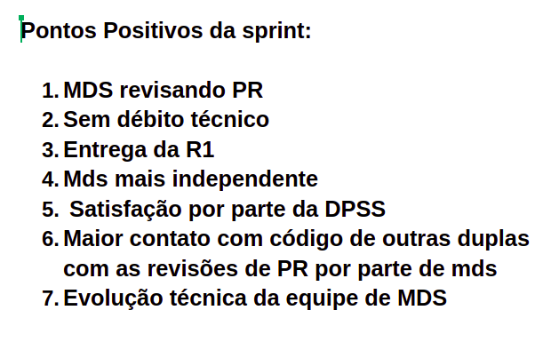

# Retrospectiva da Sprint 6

## Análise da sprint

- Sprint com bastante desenvolvimento individual por parte dos membros de MDS.
- Entrega da primeira release do produto.
- Membros da DPSS aprovaram e estão muito contente com o desenvolvimento do produto.
- Na última semana da release, foi notado uma demora tanto para a abertura como para correção dos pull request.

## Pontos Positivos listados pela equipe
  

## Pontos a Melhorar listados pela equipe 
  