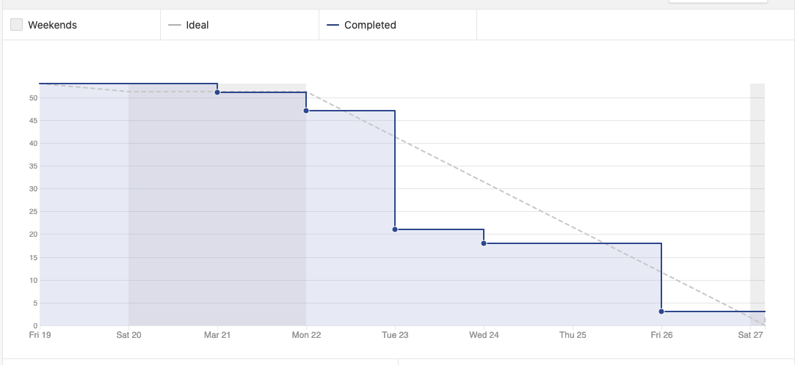

# Sprint 6 - Review 

## Resultados obtidos na sprint 6

Na sprint 6 a quantidade de pontos concluídos diminuiu, devido ao lançamento previsto da primeira release durante a semana, fazendo o foco da equipe permanecer em fixes e documentação, portanto não havendo histórias de usuário. Também houve a gravação do vídeo de avaliação e geração de tags de release.

## Tarefas da sprint

### Tarefas Realizadas:

|Tarefa|Pontuação|Concluída|
|--|--|--|
[Criar Documentação de Review da Sprint 6](https://github.com/fga-eps-mds/2020-2-SiGeD/issues/7)|2|<image src="https://i.pinimg.com/originals/21/3d/c0/213dc0ed0a2e69d1978c75bfbcff903a.png" width=30 height=35>|
[Criar Documentação de Planning da Sprint 6](https://github.com/fga-eps-mds/2020-2-SiGeD/issues/7)|2|<image src="https://i.pinimg.com/originals/21/3d/c0/213dc0ed0a2e69d1978c75bfbcff903a.png" width=30 height=35>|
[Dojo Context](https://github.com/fga-eps-mds/2020-2-SiGeD/issues/7)|2|<image src="https://i.pinimg.com/originals/21/3d/c0/213dc0ed0a2e69d1978c75bfbcff903a.png" width=30 height=35>|
[Dojo de Teste](https://github.com/fga-eps-mds/2020-2-SiGeD/issues/7)|3|<image src="https://i.pinimg.com/originals/21/3d/c0/213dc0ed0a2e69d1978c75bfbcff903a.png" width=30 height=35>|
[Aplicação Identidade Visual](https://github.com/fga-eps-mds/2020-2-SiGeD/issues/7)|3|<image src="https://i.pinimg.com/originals/21/3d/c0/213dc0ed0a2e69d1978c75bfbcff903a.png" width=30 height=35>|
[Context API](https://github.com/fga-eps-mds/2020-2-SiGeD/issues/7)|2|<image src="https://i.pinimg.com/originals/21/3d/c0/213dc0ed0a2e69d1978c75bfbcff903a.png" width=30 height=35>|
[Fix metodologia](https://github.com/fga-eps-mds/2020-2-SiGeD/issues/7)|1|<image src="https://i.pinimg.com/originals/21/3d/c0/213dc0ed0a2e69d1978c75bfbcff903a.png" width=30 height=35>|
[Fix dropdown](https://github.com/fga-eps-mds/2020-2-SiGeD/issues/7)|2|<image src="https://i.pinimg.com/originals/21/3d/c0/213dc0ed0a2e69d1978c75bfbcff903a.png" width=30 height=35>|
[Fix EVM](https://github.com/fga-eps-mds/2020-2-SiGeD/issues/7)|3|<image src="https://i.pinimg.com/originals/21/3d/c0/213dc0ed0a2e69d1978c75bfbcff903a.png" width=30 height=35>|
[Fix validate backend de clientes](https://github.com/fga-eps-mds/2020-2-SiGeD/issues/7)|1|<image src="https://i.pinimg.com/originals/21/3d/c0/213dc0ed0a2e69d1978c75bfbcff903a.png" width=30 height=35>|
[Navegação](https://github.com/fga-eps-mds/2020-2-SiGeD/issues/7)|2|<image src="https://i.pinimg.com/originals/21/3d/c0/213dc0ed0a2e69d1978c75bfbcff903a.png" width=30 height=35>|
[Fix backlog](https://github.com/fga-eps-mds/2020-2-SiGeD/issues/7)|3|<image src="https://i.pinimg.com/originals/21/3d/c0/213dc0ed0a2e69d1978c75bfbcff903a.png" width=30 height=35>|
[Landing Page](https://github.com/fga-eps-mds/2020-2-SiGeD/issues/7)|2|<image src="https://i.pinimg.com/originals/21/3d/c0/213dc0ed0a2e69d1978c75bfbcff903a.png" width=30 height=35>|
[Padronizar idioma](https://github.com/fga-eps-mds/2020-2-SiGeD/issues/7)|2|<image src="https://i.pinimg.com/originals/21/3d/c0/213dc0ed0a2e69d1978c75bfbcff903a.png" width=30 height=35>|
[Fix de usuários](https://github.com/fga-eps-mds/2020-2-SiGeD/issues/7)|2|<image src="https://i.pinimg.com/originals/21/3d/c0/213dc0ed0a2e69d1978c75bfbcff903a.png" width=30 height=35>|
[Deploy](https://github.com/fga-eps-mds/2020-2-SiGeD/issues/7)|2|<image src="https://i.pinimg.com/originals/21/3d/c0/213dc0ed0a2e69d1978c75bfbcff903a.png" width=30 height=35>|
[Ajustes dos botões](https://github.com/fga-eps-mds/2020-2-SiGeD/issues/7)|3|<image src="https://i.pinimg.com/originals/21/3d/c0/213dc0ed0a2e69d1978c75bfbcff903a.png" width=30 height=35>|
[Melhoria nas mensagens de erro](https://github.com/fga-eps-mds/2020-2-SiGeD/issues/7)|3|<image src="https://i.pinimg.com/originals/21/3d/c0/213dc0ed0a2e69d1978c75bfbcff903a.png" width=30 height=35>|
[Fix arquivos style](https://github.com/fga-eps-mds/2020-2-SiGeD/issues/7)|2|<image src="https://i.pinimg.com/originals/21/3d/c0/213dc0ed0a2e69d1978c75bfbcff903a.png" width=30 height=35>|
[Roadmap](https://github.com/fga-eps-mds/2020-2-SiGeD/issues/7)|3|<image src="https://i.pinimg.com/originals/21/3d/c0/213dc0ed0a2e69d1978c75bfbcff903a.png" width=30 height=35>|
[Melhorar a modal](https://github.com/fga-eps-mds/2020-2-SiGeD/issues/7)|3|<image src="https://i.pinimg.com/originals/21/3d/c0/213dc0ed0a2e69d1978c75bfbcff903a.png" width=30 height=35>|
[Arrumar a modal de edição](https://github.com/fga-eps-mds/2020-2-SiGeD/issues/7)|3|<image src="https://i.pinimg.com/originals/21/3d/c0/213dc0ed0a2e69d1978c75bfbcff903a.png" width=30 height=35>|
[Exigir token para as requisições da API](https://github.com/fga-eps-mds/2020-2-SiGeD/issues/7)|2|<image src="https://i.pinimg.com/originals/21/3d/c0/213dc0ed0a2e69d1978c75bfbcff903a.png" width=30 height=35>|
[Componentizar funções axios restantes](https://github.com/fga-eps-mds/2020-2-SiGeD/issues/7)|2|<image src="https://i.pinimg.com/originals/21/3d/c0/213dc0ed0a2e69d1978c75bfbcff903a.png" width=30 height=35>|
[Melhorar Navegação no MKDocs](https://github.com/fga-eps-mds/2020-2-SiGeD/issues/7)|2|<image src="https://i.pinimg.com/originals/21/3d/c0/213dc0ed0a2e69d1978c75bfbcff903a.png" width=30 height=35>|

### Burndown
 

### Velocity
 

### Conhecimento dos membros
 
 