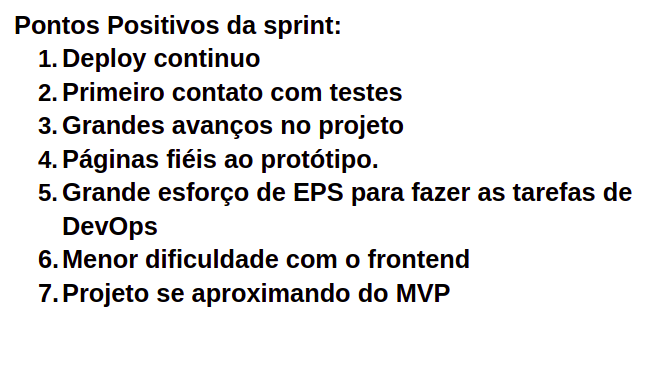

# Retrospectiva da Sprint 7

## Análise da sprint

- A implementação do deploy contínuo facilitou bastante o acesso do client a versão mais nova do produto.
- A implementação dos primeiros teste facilitou a mantenabilidade do código e suas funcionalidades.
- Foi relatado problemas no pareamento pelas duplas que apresentarem muitas tarefas de outras atividades durante a semana.

## Pontos Positivos listados pela equipe
  

## Pontos a Melhorar listados pela equipe 
  