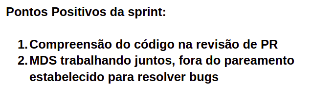
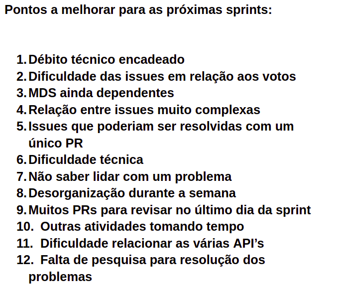

# Retrospectiva da Sprint 8

## Análise da sprint

- MDS iniciando revisão de PR's e tomando conhecimento sobre as atividades de outras duplas.
- Semana complicada com débito técnico acumulado e bastante estressante.
- Foi relatado dificuldades em como lidar com o back-end e problemas de programação.

## Pontos Positivos listados pela equipe
  

## Pontos a Melhorar listados pela equipe 
  