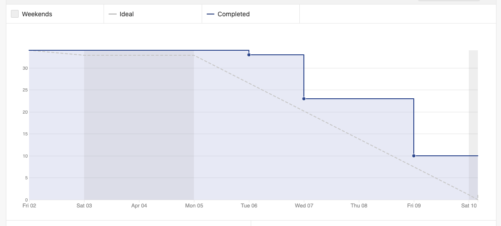
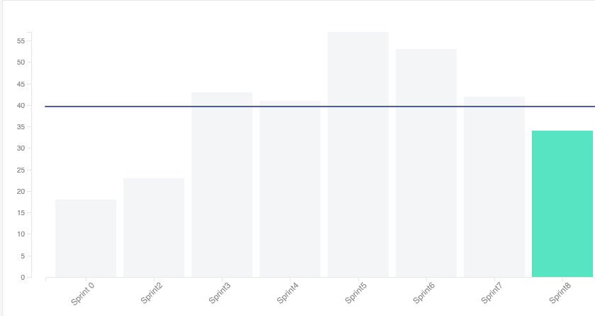
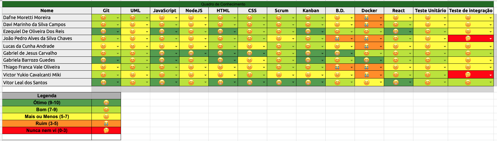

# Sprint 8 - Review 

## Resultados obtidos na sprint 8

Na sprint 8 a quantidade de pontos concluídos diminuiu, devido à alguns débitos técnicos. Tais débitos tiveram como motivo muitas atividades de outras matérias de todo o grupo, o que prejudicou o desenvolvimento das atividades.

## Tarefas da sprint

### Tarefas Realizadas:

|Tarefa|Pontuação|Concluída|
|--|--|--|
[Fix Deploy de frontend](https://github.com/fga-eps-mds/2020-2-G4/issues/164)|1|<image src="https://i.pinimg.com/originals/21/3d/c0/213dc0ed0a2e69d1978c75bfbcff903a.png" width=30 height=35>|
[Criar Documentação de Review da Sprint 7](https://github.com/fga-eps-mds/2020-2-G4/issues/172)|2|<image src="https://i.pinimg.com/originals/21/3d/c0/213dc0ed0a2e69d1978c75bfbcff903a.png" width=30 height=35>|
[Criar Documentação de Planning da Sprint 8](https://github.com/fga-eps-mds/2020-2-G4/issues/168)|2|<image src="https://i.pinimg.com/originals/21/3d/c0/213dc0ed0a2e69d1978c75bfbcff903a.png" width=30 height=35>|
[Filtro de setores](https://github.com/fga-eps-mds/2020-2-G4/issues/159)|2|<image src="https://i.pinimg.com/originals/21/3d/c0/213dc0ed0a2e69d1978c75bfbcff903a.png" width=30 height=35>|
[Editar Demandas](https://github.com/fga-eps-mds/2020-2-G4/issues/156)|2|<image src="https://i.pinimg.com/originals/21/3d/c0/213dc0ed0a2e69d1978c75bfbcff903a.png" width=30 height=35>|
[Visualizar clientes desativados](https://github.com/fga-eps-mds/2020-2-G4/issues/170)|2|<image src="https://i.pinimg.com/originals/21/3d/c0/213dc0ed0a2e69d1978c75bfbcff903a.png" width=30 height=35>|
[Atualizar Documento de arquitetura](https://github.com/fga-eps-mds/2020-2-G4/issues/166)|2|<image src="https://i.pinimg.com/originals/21/3d/c0/213dc0ed0a2e69d1978c75bfbcff903a.png" width=30 height=35>|
[Visualizar demandas desativadas](https://github.com/fga-eps-mds/2020-2-G4/issues/169)|3|<image src="https://i.pinimg.com/originals/21/3d/c0/213dc0ed0a2e69d1978c75bfbcff903a.png" width=30 height=35>|
[Histórico de setores em uma demanda](https://github.com/fga-eps-mds/2020-2-G4/issues/163)|5|<image src="https://i.pinimg.com/originals/21/3d/c0/213dc0ed0a2e69d1978c75bfbcff903a.png" width=30 height=35>|
[Visualização e Criação de Atualização de Demanda](https://github.com/fga-eps-mds/2020-2-G4/issues/171)|5|<image src="https://i.pinimg.com/originals/21/3d/c0/213dc0ed0a2e69d1978c75bfbcff903a.png" width=30 height=35>|
[Criar Demandas](https://github.com/fga-eps-mds/2020-2-G4/issues/151)|8|<image src="https://i.pinimg.com/originals/21/3d/c0/213dc0ed0a2e69d1978c75bfbcff903a.png" width=30 height=35>|
[Incluir nome do projeto em todos os repositórios](https://github.com/fga-eps-mds/2020-2-G4/issues/174)|1|<image src="https://contmoura.com.br/wp-content/uploads/2019/09/x-png-icon-8.png" width=30 height=30>|
[CI de Testes %](https://github.com/fga-eps-mds/2020-2-G4/issues/165)|2|<image src="https://contmoura.com.br/wp-content/uploads/2019/09/x-png-icon-8.png" width=30 height=30>|
[Limitar a visualização de telas baseada no tipo de usuário](https://github.com/fga-eps-mds/2020-2-G4/issues/161)|3|<image src="https://contmoura.com.br/wp-content/uploads/2019/09/x-png-icon-8.png" width=30 height=30>|
[Acesso somente via login](https://github.com/fga-eps-mds/2020-2-G4/issues/162)|3|<image src="https://contmoura.com.br/wp-content/uploads/2019/09/x-png-icon-8.png" width=30 height=30>|
[Gerar nome da tag por script](https://github.com/fga-eps-mds/2020-2-G4/issues/173)|5|<image src="https://contmoura.com.br/wp-content/uploads/2019/09/x-png-icon-8.png" width=30 height=30>|

- As issues ***Incluir nome do projeto em todos os repositórios***, ***CI de Testes %***, ***Limitar a visualização de telas baseada no tipo de usuário***, ***Acesso somente via login***, ***Gerar nome da tag por script*** foram como débito técnico para a próxima sprint.

### Burndown
 

### Velocity
 

### Conhecimento dos membros
 
 