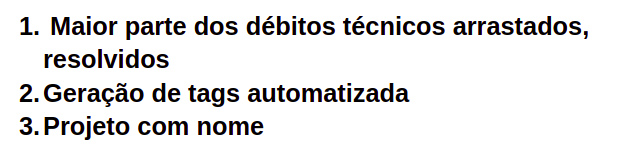

# Retrospectiva da Sprint 9

## Análise da sprint

- A equipe conseguiu retormar as atividades da sprint.
- Avanços na organização das atividades.
- Problemas com aparelhos eletrônicos dos membros de MDS prejudicou o produtividade da equipe.

## Pontos Positivos listados pela equipe
  

## Pontos a Melhorar listados pela equipe 
  