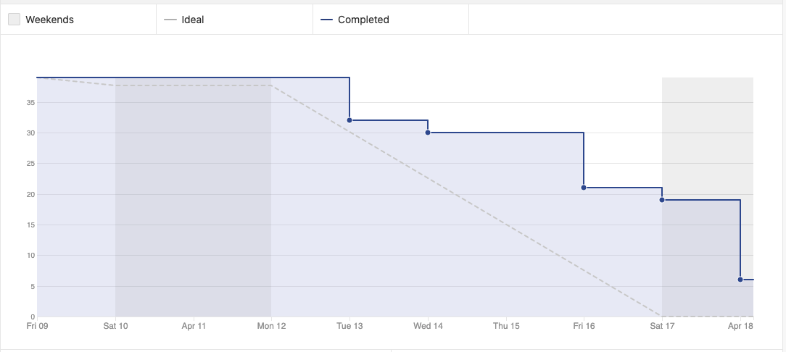
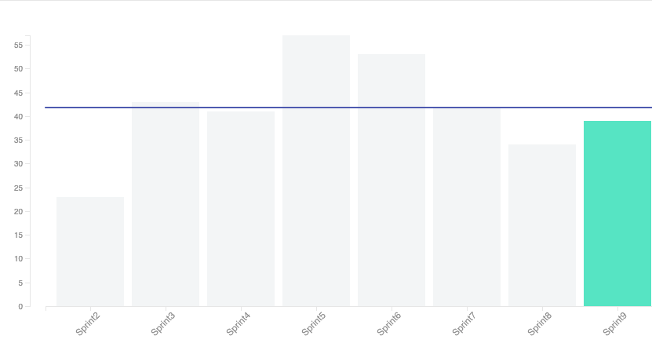
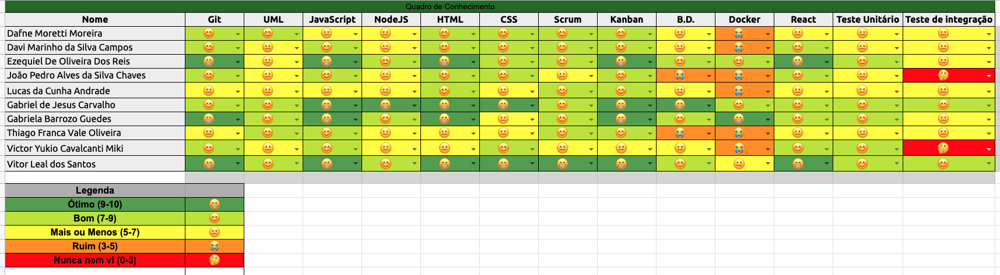

# Sprint 9 - Review 

## Resultados obtidos na sprint 9

Na sprint 9 a quantidade de pontos concluídos diminuiu, devido à alguns débitos técnicos obtidos na sprint anterior, com isso o foco maior foi em cumprir os debitos e finalizar as histórias de usuário para o MVP

## Tarefas da sprint

### Tarefas Realizadas:

|Tarefa|Pontuação|Concluída|
|--|--|--|
[Criar Documentação de Review da Sprint 8](https://github.com/fga-eps-mds/2020-2-SiGeD/issues/187)|1|<image src="https://i.pinimg.com/originals/21/3d/c0/213dc0ed0a2e69d1978c75bfbcff903a.png" width=30 height=35>|
[Criar Documentação de Planning da Sprint 9](https://github.com/fga-eps-mds/2020-2-SiGeD/issues/192)|2|<image src="https://i.pinimg.com/originals/21/3d/c0/213dc0ed0a2e69d1978c75bfbcff903a.png" width=30 height=35>|
[Incluir nome do projeto em todos os repositórios](https://github.com/fga-eps-mds/2020-2-SiGeD/issues/174)|2|<image src="https://i.pinimg.com/originals/21/3d/c0/213dc0ed0a2e69d1978c75bfbcff903a.png" width=30 height=35>|
[Limitar a visualização de telas baseada no tipo de usuário](https://github.com/fga-eps-mds/2020-2-SiGeD/issues/161)|2|<image src="https://i.pinimg.com/originals/21/3d/c0/213dc0ed0a2e69d1978c75bfbcff903a.png" width=30 height=35>|
[CI de Testes %](https://github.com/fga-eps-mds/2020-2-SiGeD/issues/165)|2|<image src="https://i.pinimg.com/originals/21/3d/c0/213dc0ed0a2e69d1978c75bfbcff903a.png" width=30 height=35>|
[Acesso somente via login](https://github.com/fga-eps-mds/2020-2-SiGeD/issues/162)|2|<image src="https://i.pinimg.com/originals/21/3d/c0/213dc0ed0a2e69d1978c75bfbcff903a.png" width=30 height=35>|
[Gerar nome da tag por script](https://github.com/fga-eps-mds/2020-2-SiGeD/issues/173)|2|<image src="https://i.pinimg.com/originals/21/3d/c0/213dc0ed0a2e69d1978c75bfbcff903a.png" width=30 height=35>|
[Editar atualizações relacionadas a uma demanda](https://github.com/fga-eps-mds/2020-2-SiGeD/issues/177)|3|<image src="https://i.pinimg.com/originals/21/3d/c0/213dc0ed0a2e69d1978c75bfbcff903a.png" width=30 height=35>|
[Deletar atualizações relacionadas a uma demanda](https://github.com/fga-eps-mds/2020-2-SiGeD/issues/178)|5|<image src="https://i.pinimg.com/originals/21/3d/c0/213dc0ed0a2e69d1978c75bfbcff903a.png" width=30 height=35>|
[Restringir a visualização de uma atualização para somente um setor](https://github.com/fga-eps-mds/2020-2-SiGeD/issues/179)|5|<image src="https://i.pinimg.com/originals/21/3d/c0/213dc0ed0a2e69d1978c75bfbcff903a.png" width=30 height=35>|
[Filtro de demandas por cliente específico](https://github.com/fga-eps-mds/2020-2-SiGeD/issues/185)|8|<image src="https://i.pinimg.com/originals/21/3d/c0/213dc0ed0a2e69d1978c75bfbcff903a.png" width=30 height=35>|
[Lista de demandas por cliente específico](https://github.com/fga-eps-mds/2020-2-SiGeD/issues/186)|1|<image src="https://i.pinimg.com/originals/21/3d/c0/213dc0ed0a2e69d1978c75bfbcff903a.png" width=30 height=35>|
[Fix Demanda](https://github.com/fga-eps-mds/2020-2-SiGeD/issues/181)|2|<image src="https://i.pinimg.com/originals/21/3d/c0/213dc0ed0a2e69d1978c75bfbcff903a.png" width=30 height=35>|
[Adicionar o setor no usuário e tempo de token](https://github.com/fga-eps-mds/2020-2-SiGeD/issues/182)|3|<image src="https://i.pinimg.com/originals/21/3d/c0/213dc0ed0a2e69d1978c75bfbcff903a.png" width=30 height=35>|
[Fix criação de clientes](https://github.com/fga-eps-mds/2020-2-SiGeD/issues/183)|3|<image src="https://i.pinimg.com/originals/21/3d/c0/213dc0ed0a2e69d1978c75bfbcff903a.png" width=30 height=35>|
[Adicionar usuário ao context](https://github.com/fga-eps-mds/2020-2-SiGeD/issues/184)|5|<image src="https://i.pinimg.com/originals/21/3d/c0/213dc0ed0a2e69d1978c75bfbcff903a.png" width=30 height=35>|

- Os débitos técnicos originados na sprint anterior foram todos entregues

### Burndown
 

### Velocity
 

### Conhecimento dos membros
 
 